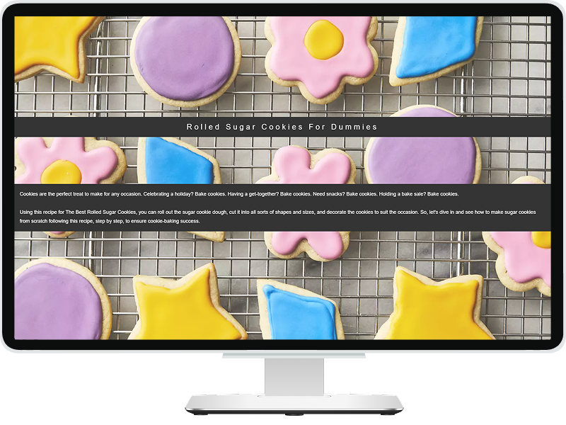

# Parallax

### Goal: a small project for exploring parallax effect.

## Features

"Parallax" is a beautifully crafted webpage showcasing a detailed cookie recipe. Built with HTML and CSS. The page uses parallax effects both across the entire page and within specific sections for added depth. High-quality images, relevant text, and well-chosen colors enhance the user experience, making it visually appealing and easy to follow.

 

